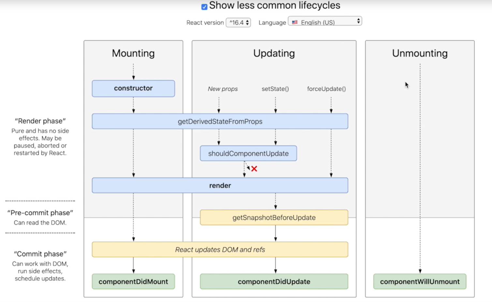

# MCA-React-Essentials

## Convert Card component to class base component

In this task, we are going to change `Card` component from **functional** base to **class** base.
- for this, first we are going to import the `Component`
- change the `function` keyword to `class` and **extend** it from `Component`
- create a **render(){}** function and move the **return()** function into this newly created render() function
- Now, since we do not have `props` instead, we can use `this.props` at all of the seven locations inside return() function

So we can see that everything works fine even after we change from functional to class based component.

## LifeCycle Methods Diagram

Go to this URL: http://projects.wojtekmaj.pl/react-lifecycle-methods-diagram/

Or consider this image below:



### React lifecycle hass three categories:
1. Mounting
2. Updating
3. Unmounting

**Mounting** is the "**birth**" of the component

**Updating** is the "**growth**" of the component

**Unmounting** is the "**death**" of the component

## React lifecycle - 1. Mounting

Now we are going to talk about **mounting**. First we are going to talk about constructor, but first let's add a `console.log('App.js constructor')` in the constructor.

### constructor() :

```js
constructor(props){
    console.log('App.js - constructor')
    //...
}
```

As we've already seen that in your Component, you should not call the **setState()**. Instead, if your **component** needs to use `"local state"` aside the `"initial state"` to this state directly in this **constructor**, the **constructor** is the only place that you can assign this state directly.

In any other method (say: `deleteCardHandler()`, `changeNameHandler()`, etc) you should use the `'this.setState()'` since they do not do any side effect or subscriptions in the constructor. If you really need to do this, you have o use the **componentDidMount** instead.

### getDerivedStateFromProps() :

To understand `getDerivedStateFromProps` let's create a new method:

```js
// inside "App.js" file
static getDerivedStateFromProps(props, state) {
    console.log('Card.js - getDerivedStateFromProps', props)
    return state
}
```
In order to get something pop out here: 

`console.log('Card js getDerivedStateFromProps', props) // <= here!`,

go to the `index.js` file and create a **title** to the app (to get derived state from props) and this is the only purpose.
- This is _not_ a very common React lifecycle method.
- It enables the **component** to update its internal state as the result of changes in **props**.
- It is usually used in something like scroll direction based on the changing offset props.

```js
// in "index.js" file:
  <React.StrictMode>
    <App title="App Title" />
  </React.StrictMode>
```

### render() :

Let's go to the **render()** method and add this:

`console.log('App.js - render')`

**React** require that you have to make the `render()` method "pure" _(**pure** functions are those which do not have side effects by making some HTTP request and always have the same output when the same inputs are passed)_

This means that you can not use `setState()` within this method.

### componentDidMount() :

Let's add this next method as well (above render() method, maybe?)

```js
componentDidMount() {
    console.log('App.js - componentDidMount')
}
```

- The `componentDidMount` method is invoked immediately after a component is mounted.
- If you leave to load data from a remote endpoint, then this is a very good place to make some HTTP request.
- This method is good to set up any subscription but if you do that, don't forget to unsubscribe with the `componentDidUnmount` method that we will talk about later.

Now, we go to **Card.js** as we also want to see the Card rendering. So let's add a console.log() function to the render() method there:

`console.log("Card.js rendering")`

Now, in the **console**, you can see that the **App.js** _constructor_ runs first and then it will get a `getDerivedStateFromProps` and then the **App.js** starts to render and then, the `Card` also renders  times. And at the last, it called the componentDidMount method.

You can also observe something very weird, that all runs twice. This is because in the recent version, the rendering use `strict mode` when running in development. So strict method intentionally double calls the constructor and render method to better deal with unexpected side effects.

So, if we want to make a real one (render as it will do in production) we have to use a production build of React.

To do this, (we first need to beware that we also have a React Developer tools extension available for extensive debugging, which we'll talk later in detail) firstly check that the React Developer Tools is showing the icon as 'red' which signifies that this app is running in development build ad not a production build.

To create a production build, we have to run `npm run build` and now when you open the app in production build, you will find that the color of the icon in the extension will turn 'blue', showing that we are running production build of this React app. Now when you take a look at the console, you will be able to see that the console log messages are showing correct counts as they're intended to be.

So, we can see that it follow the order of the **constructor** which get derived from pops and from there, it go to the **render**. it renders 3 cards and then at last is the **componentDidMount**.

So this is the **mounting** life cycle of React.

## React lifecycle - 2. Updating

We are now going to learn the second part in React lifecycle, which is **Updating**. It is the middle step among the three steps.

### getDerivedStateFromProps :

The first step in **Updating** is `getDerivedStateFromProps` that we already leant in previous step (Mounting). So we can add the below mentioned function to the `Card.js` component above the `render()` method:

```js
static getDerivedStateFromProps(props, state) {
  console.log('Card.js - getDerivedStateFromProps')
  return state
}
```

### shouldComponentUpdate :

The next part is: `shouldComponentUpdate` in which, firstly React needs to know that if a component output is not affected by the current change in state or props. Of course the default behavior is to **re-render** on every `state` change. This method is invoked **_before rendering_** when new `props` or `state` are being received. The default value should be 'true'. This method is rarely used and it only exists for performance optimization and therefore do not rely on **event** rendering and this may cause a box. So now let's add **shouldComponentUpdate** method to the `Card` component and set the default value to be 'true' at first, like this:

```js
static shouldComponentUpdate(nextProps, nextState) {
  console.log('Card.js - shouldComponentUpdate')
  return true
}
```

### render :

And now, the next step in **Updating** is the render() method, which we already explained in the previous step. The explanation of this step remains the same as before.

### getSnapshotBeforeUpdate :

Now we can go to the next step, which is: `getSnapshotBeforeUpdate`. This **getSnapshotBeforeUpdate** is a new life cycle method introduced in React. Any value returned by these lifecycle  will be passed as a parameter to **componentDidUpdate** and this is not very common. This method is used to handle some cases such as when the scope is positioned in a special way.

Let's add this method as well and we are going to return some snapshot here and to see whether it will also be displayed in the **componentDidUpdate** method.

```js
getSnapshotBeforeUpdate(prevProps, prevState) {
  console.log('Card.js - getSnapshotBeforeUpdate')
  // return null
  return { message: 'some snapshot' }
}
```

### componentDidUpdate :

So the last thing is the **componentDidUpdate** that we just said; this life cycle method is invoked as soon as the updating happens. The most common use case for the **componentDidUpdate** is to update the **DOM**; it responds to the `Pops` or `state` change.

This is also a good place to do some HTTP request as long as you compare with the current `prop` to the previous `prop`.

You can also set `state` here but remember to check where the `state` or `prop` change for the previous `state`. The improper use of `setState` can lead to an infinite loop.

So now we'll add **componentDidUpdate** and we are also testing whether it will display the snapshot. And `return { message: 'some snapshot'}` <- this is the snapshot that we expect to be displayed in componentDidUpdate.

```js
componentDidUpdate(prevProps, prevState, snapshot) {
    console.log('Card.js - componentDidUpdate', snapshot)
}
```

Now we are going to try to build the App using `npm run build`. As you can see that this is the production build (in the console) and you can see that this is the original creation lifecycle (which is being displayed in the console) which is the `constructor` first then the `getDerivedStateFromProps` of **App.js** and then it starts `render`-ing the **App.js** and then by `render`ing the three `Card`s and then it will end with the **App.js** `componentDidMount` and you can see there is no `componentDidUpdate` here because we haven't update any changes in the `Card`.

So let's try to type some words to make some changes in the 'Name' inside a `Card` and then you will be able to see `shouldComponentupdate` here as there is only one Card changed here (in which we changed the name manually). And as you can see that snapshot already passed to `componentDidUpdate`

The last thing now which we have to try is to change the **return** value of `shouldComponentupdate` to 'false' and try to 'npm run build' again. So after we refresh the page again and then try to update the name in the card, since we already set `shouldComponentUpdate` to 'false', so you can see that even when we type in the name field, this can't be updated.

This is how the `shouldComponentUpdate` works and how the React lifecycle of **Updating** step works.

## React lifecycle - 3. Unmounting

The last part of the React lifecycle is **Unmounting**. This lifecycle method is method is called just before component is unmounted and destroyed. This is the right place to do cleanup. In this method, we can do some cleanup tasks such as cancelling the network request or killing any subscription that were created in `componentDidMount`.

Let's go to the `Card.js` and now we are going to add a `componentWillUnmount` method:

```js
componentWillUnmount() {
  console.log('Card.js - component will unmount')
}
```

In order to let this log (in the above method) appear, we have to make some method such that this `componentWillUnmount` will come into action. So let's go back to the `App.js` file and go to the **render()** method and add this on the top:

```js
render() {
  if (this.state.showCard === false) {
    return <div>nothing</div>
  }
}
//...
```

So now the whole thing inside **return()** method will disappear. So all the Cards will also unmount. let's give it a try by firing this command: `npm start`

Now when we click the `Toggle show/hide` button, all the cards will disappear along with the two Toggle buttons will also disappear and hence all the cards will unmount. Inside the console, you will see that the three cards have displayed `component will unmount` message due the the function `componentWillUnmount` which we added in the end.
